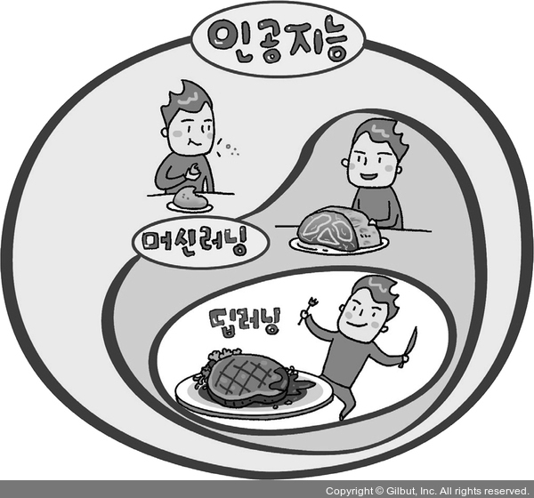

### 1. 인공지능? 머신 러닝? 딥러닝?
머신 러닝: 기존의 데이터를 이용해 앞으로 일을 예측
딥러닝: 머신 러닝 안에는 여러 알고리즘이 있는데, 이 중 가장 좋은 효과를 내는 것

 

### 2. 딥러닝 실행을 위해 필요한 세 가지
**1\. 데이터**  
지도 학습: 이름표가 주어진 데이터를 이용해 그 이름표를 맞히는 것
비지도 학습: 이름표가 없는 데이터에서 공통적인 특징을 찾아내고 그룹을 분류

**2\. 컴퓨터(CPU? GPU?)**  
일반 CPU 컴퓨터 또는 고속 그래픽 처리에 특화된 전용 프로세서 GPU

**3\. 프로그램**  
딥러닝을 구동할 수 있도록 프로그래밍  
 

### 3. 구글 코랩 실행하기
