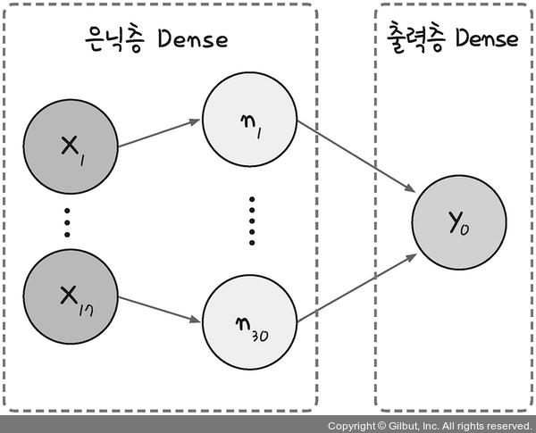

### 1. 미지의 일을 예측하는 원리
<p align="center"></p>
<p align="center">(예시) 수술하기 전에 수술 후의 생존율을 수치로 예측하는 방법</p>
<p align="center"></p>

생존율을 정리해 놓은 **데이터** 를 머신 러닝 알고리즘에 넣는다.<br>
머신 러닝은 데이터가 가진 패턴과 규칙을 분석해서 저장해 둔다.<br>
새로운 환자가 오면 저장된 분석 결과와 비교해 생존 가능성을 예측한다.<br>
\* 학습(training): 데이터가 입력되고 패턴이 분석되는 과정<br>
<br>

### 2. 딥러닝 코드 실행해 보기
```python
# 텐서플로의 케라스 API에서 필요한 함수들을 불러옵니다.
from tensorflow.keras.models import Sequential
# 데이터를 다루는 데 필요한 라이브러리를 불러옵니다.
from tensorflow.keras.layers import Dense
import numpy as np

# 깃허브에 준비된 데이터를 가져옵니다.
!git clone https://github.com/taehojo/data.git

# 수술 환자 데이터를 불러옵니다.
Data_set = np.loadtxt("./data/ThoraricSurgery3.csv", delimiter=",")
# 환자의 진찰 기록을 X로 지정합니다.
X = Data_set[:,0:16]
# 수술 1년 후 사망/생존 여부를 y로 지정합니다.
y = Data_set[:,16]  

# 딥러닝 모델의 구조를 결정합니다.
model = Sequential()                                                  
model.add(Dense(30, input_dim=16, activation='relu'))
model.add(Dense(1, activation='sigmoid'))

# 딥러닝 모델을 실행합니다.
model.compile(loss='binary_crossentropy', optimizer='adam', metrics=['accuracy'])
history=model.fit(X, y, epochs=5, batch_size=16)
```
<br>

### 3. 딥러닝 개괄하기
**1\. 환경 준비**<br>
딥러닝을 구동하는 데 필요한 라이브러리 호출<br>
<br>
**2\. 데이터 준비**<br>
데이터를 불러와 사용할 수 있도록 준비<br>
코랩에서 코드를 실행하면 data 폴더에서 git으로 불러온 데이터를 확인할 수 있다.<br>
<p align="center"></p>
<p align="center"></p>
딥러닝을 위해서는 **속성**과 **클래스**를 서로 다른 **데이터셋**으로 지정해 주어야 한다.<br>
<br>

**3\. 구조 결정**<br>
어떤 딥러닝 구조를 만들 것인가<br>
텐서플로는 구글에서 만든 딥러닝 전용 라이브러리이다. 텐소플로는 다양한 딥러닝 작업을 할 수 있지만 사용법이 쉽지 않다. 그래서 편한 사용을 위해 케라스를 사용한다.<br>
Sequential(): 딥러닝의 한 층 한 층을 model.add() 함수를 사용해 추가시켜 준다.<br>
<a href="https://keras.io/ko/models/about-keras-models" target="_blank">https://keras.io/ko/models/about-keras-models</a><br>
<p align="center"></p>
<br>
Dense(): 각 층의 입력과 출력을 촘촘하게 연결한다. (가중치 포함)<br>
<p align="center"></p>
딥러닝을 설계한다는 것은 결국 몇 개의 층을 어떻게 쌓을지, Dense 외에 어떤 층을 사용할지, 내부의 변수들을 어떻게 정해야 하는지 등에 대해 고민하는 것이다.<br>
<br>

**4\. 모델 실행**<br>
만든 딥러닝을 실행시키고 결과 확인