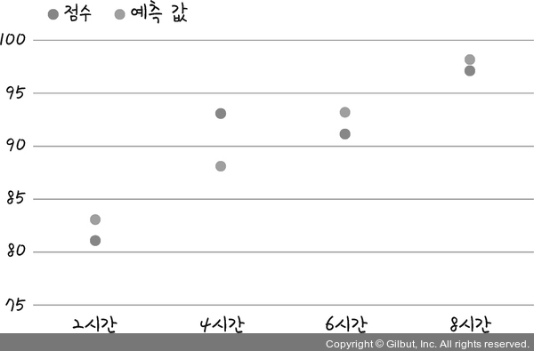
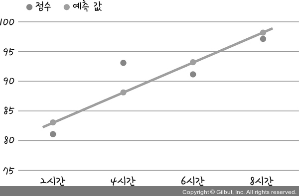
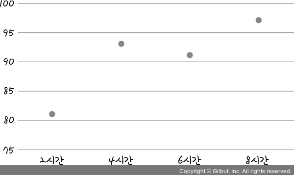
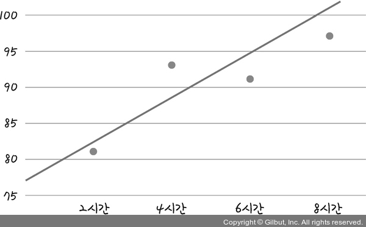
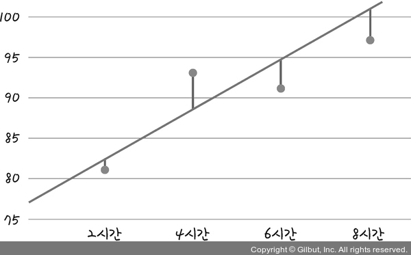
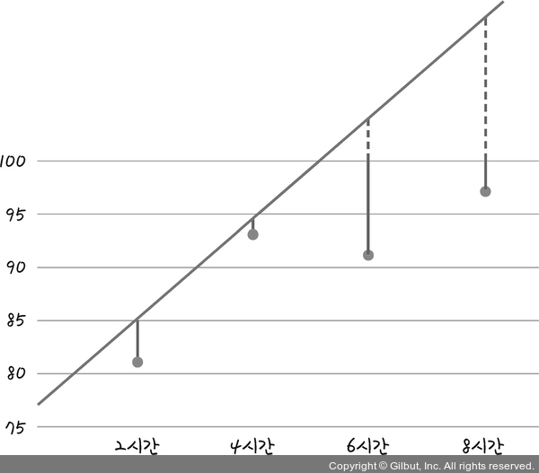
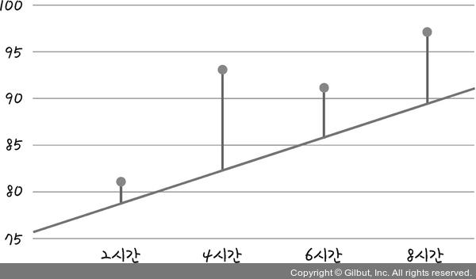

머신 러닝은 제대로 된 선을 긋는 작업부터 시작된다.<br>
선의 방향을 잘 정하면 그 선을 따라가는 것만으로도 지금은 보이지 않는 미래의 것을 예측할 수 있기 때문이다.<br>
<br>

### 1. 선형 회귀(Linear regression)의 정의
```
"학생들의 중간고사 성적이 다 다르다."
```
위 문장이 나타낼 수 있는 정보는 너무 제한적이다.
```
"학생들의 중간고사 성적이 [         ]에 따라 다 다르다."
```
이 문장은 정보가 담길 여지를 열어 놓고 있다.<br>
[      ] 부분에 시험 성적을 좌우할 만한 여러 가지 것이 들어간다면 좀 더 많은 사실을 전달할 수 있다.<br>
따라서 앞의 문장보다는 이 문장이 중간고사 성적의 차이와 이유를 나타낼 때 더욱 효과적이다.<br>
<br>
여기서 [      ]에 들어갈 내용을 `정보`라고 한다. 머신 러닝과 딥러닝은 이 정보가 필요하다.<br>
정보를 정확히 준비해 놓기만 하면 성적을 예측하는 방정식을 만들 수도 있다.<br>
<br>
성적을 변하게 하는 `정보` 요소를 $x$라고 하고, 이 $x$ 값에 따라 변하는 `성적`을 $y$라고 하자.<br>
이를 정의하면 '**$x$ 값이 변함에 따라 $y$ 값도 변한다**'가 된다. 이 정의 안에서 독립적으로 변할 수 있는 값 $x$를 `독립 변수`라고 한다.<br>
또한, 이 독립 변수에 따라 종속적으로 변하는 $y$를 `종속 변수`라고 한다. 선형 회귀란 독립 변수 $x$를 사용해 종속 변수 $y$의 움직임을 예측하고 설명하는 작업을 의미한다.<br>
<br>
하나의 독립 변수 $x$ 값만으로도 $y$ 값을 설명할 수 있다면 **단순 선형 회귀(Simple linear regression)** 라고 하고 <br>
$x_1$, $x_2$, $x_3$ 등 $x$ 값이 여러 개 필요하다면 **다중 선형 회귀(Multiple linear regression)** 라고 한다.<br>
<br>

### 2. 가장 훌륭한 예측선이란?
독립 변수가 하나뿐인 단순 선형 회귀의 예를 보자.<br>
독립 변수를 `공부한 시간` 한 가지만 놓고 중간고사를 본 학생 4명의 중간고사 성적이 아래 표와 같다고 하자.<br>

|공부한 시간|2시간|4시간|6시간|8시간|
|---|---|---|---|---|
|성적|81점|93점|91점|97점|

공부한 시간을 $x$라고 하고 성적을 $y$라고 할 때, 집합 $X$와 집합 $Y$를 다음과 같이 표현할 수 있다.

$$
 \begin{aligned} &X = {2, 4, 6, 8} \\\ &Y = {81, 93, 91, 97} \end{aligned}
$$

이를 좌표 평면에 나타내면 다음 그림과 같다.
<p align="center"></p>

왼쪽이 아래로 향하고 오른쪽이 위를 향하는 일종의 `선형(선으로 표시될 만한 형태)`을 보인다.<br>
선형 회귀를 공부하는 과정은 이 점들의 특징을 가장 잘 나타내는 선을 그리는 과정과 일치한다.<br>
<br>
이 데이터에서 주어진 점들의 특징을 담은 선은 직선이므로 일차 함수 그래프이다.<br>
일차 함수 그래프는 다음과 같은 식으로 표현할 수 있다.

$$ y = ax + b $$

$x$ 값은 독립 변수이고 $y$ 값은 종속 변수이다. 즉, $x$ 값에 따라 $y$ 값은 반드시 달라진다. 다만, 정확하게 계산하려면 상수 $a$와 $b$의 값을 알아야 한다.<br>
따라서 이 직선을 훌륭하게 그으려면 직선의 기울기 $a$ 값과 $y$ 절편 $b$ 값을 정확히 예측해 내야 한다.<br>
선형 회귀는 곧 정확한 선을 그려 내는 과정이다. 지금 주어진 데이터에서의 선형 회귀는 결국 최적의 $a$ 값과 $b$ 값을 찾아내는 작업이다.<br>
<br>
선을 잘 긋는 것이 중요한 이유는 잘 그어진 선을 통해 우리는 표의 공부한 시간과 중간고사 성적 데이터에 들어 있지 않은 여러 가지 내용을 유추할 수 있기 때문이다.<br>
예를 들어 표에 나와 있지 않은 또 다른 학생의 성적을 예측하고 싶을 때 정확한 직선을 그어 놓았다면 이 학생이 몇 시간을 공부했는지만 물어보면 된다.<br>
정확한 $a$ 값과 $b$ 값을 따라 움직이는 직선에 학생이 공부한 시간인 $x$ 값을 대입하면 예측 성적인 $y$ 값을 구할 수 있다.<br>
<br>
딥러닝을 포함한 머신 러닝의 예측은 결국 이러한 기본 접근 방식과 크게 다르지 않다.<br>
기존 데이터(정보)를 가지고 어떤 선이 그려질지 예측한 후, 아직 답이 나오지 않은 그 무언가를 그 선에 대입해 보는 것이다.<br>
따라서 선형 회귀의 개념을 이해하는 것은 딥러닝을 이해하는 데 중요한 첫걸음이다.<br>
<br>

### 3. 최소 제곱법
가장 정확한 선을 긋기 위해서(정확한 기울기 $a$와 정확한 $y$ 절편 $b$를 알아내는 것) `최소 제곱법(Method of least squares)`이라는 공식을 적용한다면 일차 함수의 기울기 $a$와 $y$ 절편 $b$를 바로 구할 수 있다.<br>
지금 가진 정보가 $x$ 값(입력 값, 여기서는 '공부한 시간')과 $y$ 값(출력 값, 여기서는 '성적')일 때 이를 이용해 기울기 $a$를 구하는 방법은 다음과 같다.

$$ a = \dfrac{(x - x\text{평균})(y - y\text{평균})\text{의 합}}{(x - x\text{평균})^2\text{의 합}} $$

이것이 바로 최소 제곱법 공식이다.<br>
즉 $x$의 편차(각 값과 평균과의 차이)를 제곱해서 합한 값을 분모로 놓고, $x$와 $y$의 편차를 곱해서 합한 값을 분자로 놓으면 기울기가 나온다.<br>
실제로 우리가 가진 $y$(성적) 값과 $x$(공부한 시간) 값을 이 식에 대입해 보자.<br>
<br>
먼저 $x$ 값의 평균과 $y$ 값의 평균을 구해 보면 다음과 같다.

- 공부한 시간($x$) 평균: $ (2 + 4 + 6 + 8) \div 4 = 5 $
- 성적($y$) 평균: $ (81+ 93 + 91 + 97) \div 4 = 90.5 $
<br>
이를 식에 대입하면 다음과 같다.

$$ a = \dfrac{(2-5)(81-90.5) + (4-5)(93-90.5) + (6-5)(91-90.5) + (8-5)(97-90.5)}{(2-5)^2 + (4-5)^2 + (6-5)^2 + (8-5)^2} \\\ = \dfrac{46}{20} = 2.3 $$

기울기 $a$는 2.3이다. 다음은 $y$ 절편인 $b$를 구하는 공식이다.

$$ b = y\text{의 평균} - (x\text{의 평균} \times \text{기울기 } a) $$

이를 식에 대입하면 다음과 같다.

$$ b = 90.5 - (5 \times 2.3) = 79 $$

$y$ 절편 $b$는 79다. 이제 다음과 같이 예측 값을 구하기 위한 직선의 방정식이 완성되었다.

$$ y = 2.3x + 79 $$

이 식에 데이터를 대입해 보자. 그리고 $x$를 대입했을 때 나오는 $y$ 값을 `예측 값`이라고 하자.

|공부한 시간|2|4|6|8|
|---|---|---|---|---|
|성적|81|93|91|97|
|예측 값|83.6|88.2|92.8|97.4|

좌표 평면에 이 예측 값을 찍어 보면 다음과 같다.
<p align="center"></p>

예측한 점들을 연결해 직선을 그으면 다음과 같다.
<p align="center"></p>

이것이 바로 오차가 가장 적은 주어진 좌표의 특성을 가장 잘 나타내는 직선이다.<br>
이 직선에 우리는 다른 $x$ 값(공부한 시간)을 집어넣어서 '공부량에 따른 성적을 예측'할 수 있다.<br>
<br>

### 4. 파이썬 코딩으로 확인하는 최소 제곱
```python
# 파이썬에서 수학 연산과 분석을 하게 도와주는 라이브러리
import numpy as np

# 공부한 시간과 점수를 각각 x, y라는 이름의 넘파이 배열로 만듭니다.
x = np.array([2, 4, 6, 8])
y = np.array([81, 93, 91, 97])

# x의 평균값을 구합니다.
mx = np.mean(x)

# y의 평균값을 구합니다.
my = np.mean(y)

# 출력으로 확인합니다.
print("x의 평균값: ", mx)
print("y의 평균값: ", my)

# 기울기 공식의 분모 부분입니다.
divisor = sum([(i - mx)**2 for i in x])

# 기울기 공식의 분자 부분입니다.
def top(x, mx, y, my):
    d = 0
    for i in range(len(x)):
        d += (x[i] - mx) * (y[i] - my)
    return d
dividend = top(x, mx, y, my)

# 출력으로 확인합니다.
print("분모: ", divisor)
print("분자: ", dividend)

# 기울기 a를 구하는 공식입니다.
a = dividend / divisor

# y 절편 b를 구하는 공식입니다.
b = my - (mx*a)

# 출력으로 확인합니다.
print("기울기 a = ", a)
print("y 절편 b = ", b)
```
```
# 실행 결과
x의 평균값: 5.0
y의 평균값: 90.5

분모: 20.0
분자: 46.0

기울기 a = 2.3
y 절편 b = 79.0
```
<br>

### 5. 평균 제곱 오차
최소 제곱법을 이용해 기울기 $a$와 $y$ 절편을 편리하게 구했지만, 여러 개의 입력을 처리하기는 어렵다.<br>
딥러닝은 대부분 입력 값이 여러 개인 상황에서 이를 해결하기 위해 실행되기 때문에 기울기 $a$와 $y$ 절편 $b$를 찾아내는 다른 방법이 필요히다.<br>
<br>
가장 많이 사용하는 방법은 `일단 그리고 조금씩 수정해 나가기` 방식이다.<br>
가설을 하나 세운 후 이 값이 주어진 요건을 충족하는지 판단해서 조금씩 변화를 주고, 이 변화가 긍정적이면 오차가 최소가 될 때까지 이 과정을 계속 반복하는 방법이다.<br>
이는 딥러닝을 가능하게 하는 가장 중요한 원리 중 하나이다.<br>
<br>
그런데 선을 긋고 나서 수정하는 과정에서 나중에 그린 선이 먼저 그린 선보다 더 좋은지 나쁜지를 판단하는 것은 중요하다.<br>
즉, 각 선의 오차를 계산할 수 있어야 하고, 오차가 작은 쪽으로 바꾸는 알고리즘이 필요하다.<br>
<br>
이를 위해 주어진 선의 오차를 평가하는 방법이 필요한데, 오차를 구할 때 가장 많이 사용되는 방법이 평균 제곱 오차(Mean Square Error, MSE)이다.<br>
앞서 나온 공부한 시간과 성적의 관계도를 다시 한 번 보자.<br>
<p align="center"></p>

앞에서 최소 제곱법을 이용해 점들의 특성을 가장 잘 나타내는 최적의 직선이 $y = 2.3x + 79$임을 구했지만, 이번에는 최소 제곱법을 사용하지 않고 아무 값이나 $a$와 $b$에 대입해 보자. 임의의 값을 대입한 후 오차를 구하고 이 오차를 최소화하는 방식을 사용해서 최종 $a$ 값과 $b$ 값을 구해 보자.<br>
먼저 대강 선을 그어 보기 위해 기울기 $a$와 $y$ 절편 $b$를 임의의 수 3과 76이라고 가정해 보고 $y = 3x + 76$인 선을 그려 보면 다음과 같다.<br>
<p align="center"></p>

임의의 직선이 어느 정도의 오차가 있는지 확인하려면 각 점과 그래프 사이의 거리를 재면 된다.<br>
<p align="center"></p>

그림의 선은 직선이 잘 그어졌는지 나타낸다. 이 직선들의 합이 작을수록 잘 그어진 직선이고, 이 직선들의 합이 클수록 잘못 그어진 직선이 된다.<br>
예를 들어 기울기 값을 각각 다르게 설정한 그래프를 보자.<br>
<p align="center"></p>
<p align="center"></p>
<br>

그래프의 기울기가 잘못되었을수록 선의 거리의 합, 즉 오차의 합도 커진다. 만일 기울기가 무한대로 커지면 오차도 무한대로 커지는 상관관계가 있는 것을 알 수 있다.<br>
선의 거리의 합을 실제로 계산해 보자. 거리는 입력 데이터에 나와 있는 $y$의 '실제 값'과 $x$를 $y = 3x + 76$ 식에 대입해서 나오는 '예측 값'의 차이를 이용해 구할 수 있다.<br>
예를 들어 2시간을 공부했을 때 실제 나온 점수(81점)와 그래프 $y = 3x + 76$ 식에 $x = 2$를 대입했을 때(82점)의 차이가 곧 오차이다. 따라서 오차를 구하는 방정식은 다음과 같다.

$$ \text{오차 = 실제 값 - 예측 값} $$

이 식에 주어진 데이터를 대입해 얻을 수 있는 모든 오차 값을 정리하면 다음 표와 같다.

|공부한 시간($x$)|2|4|6|8|
|---|---|---|---|---|
|성적(실제 값, $y$)|81|93|91|97|
|예측 값|82|88|94|100|
|오차|1|-5|3|3|

이렇게 해서 구한 오차를 모두 더하면 $1 + (-5) + 3 + 3 = 2$가 된다.<br>
그런데 오차에 양수와 음수가 섞여 있어 오차를 단순히 더해 버리면 합이 0이 될 수도 있기 때문에 이 값은 오차가 실제로 얼마나 큰지를 가늠하기에는 적합하지 않다.<br>
부호를 없애야 정확한 오차를 구할 수 있다. 따라서 오차의 합을 구할 때는 각 오차 값을 제곱해 준다. 이를 식으로 표현하면 다음과 같다.

$$ \text{오차의 합} = \sum_{i}^e {(y_i -  \hat{y}_i)^2} $$

여기서 $i$는 $x$가 나오는 순서를, $n$은 $x$ 원소의 총 개수를 의미한다.<br>
$y_i$는 $x_i$에 대응하는 `실제 값`이고 는 $x_i$가 대입되었을 때 직선의 방정식(여기서는 $y = 3x + 76$)이 만드는 `예측 값`이다. 이 식으로 오차의 합을 다시 계산하면 $1 + 25 + 9 + 9 = 44$이다.<br>
평균 제곱 오차는 위에서 구한 오차의 합을 $n$으로 나눈 것이다.

$$ \text{평균 제곱 오차(MSE)} = \dfrac{1}{n} \sum{(y_i -  \hat{y}_i)^2} $$

이 식은 머신 러닝과 딥러닝을 공부할 때 자주 등장하는 중요한 식이다.<br>
앞서 구한 오차의 합(=44)과 $x$ 원소의 총 개수(=4)를 이 식에 대입하면 $\dfrac{1}{4} \times 44 = 11$이란 값이 나온다.<br>
이로써 우리가 그은 임의의 직선이 11이라는 평균 제곱 오차를 갖는 직선이었다는 것을 알 수 있다.<br>
<br>
이제 우리의 작업은 11보다 작은 평균 제곱 오차를 가지게 만드는 $a$ 값과 $b$ 값을 찾는 것이 되었다.<br>
이렇듯 선형 회귀란 임의의 직선을 그어 이에 대한 평균 제곱 오차를 구하고, 이 값을 가장 작게 만들어 주는 $a$ 값과 $b$ 값을 찾아가는 작업이다.<br>
<br>

### 6. 파이썬 코딩으로 확인하는 평균 제곱 오차
```python
import numpy as np
# 가상의 기울기 a와 y 절편 b를 정합니다.
fake_a = 3
fake_b = 76

# 공부 시간 x와 성적 y의 넘파이 배열을 만듭니다.
x = np.array([2, 4, 6, 8])
y = np.array([81, 93, 91, 97])

# y = ax + b에 가상의 a 값과 b 값을 대입한 결과를 출력하는 함수입니다.
def predict(x):
    return fake_a * x + fake_b

# 예측 값이 들어갈 빈 리스트를 만듭니다.
predict_result = []

# 모든 x 값을 한 번씩 대입해 predict_result 리스트를 완성합니다.
for i in range(len(x)):
    predict_result.append(predict(x[i]))
    print("공부시간=$.f, 실제점수=$.f, 예측점수=$.f" $ (x[i], y[i], predict(x[i])))
    
# 평균 제곱 오차 함수를 각 y 값에 대입해 최종 값을 구하는 함수입니다.
n = len(x)  
def mse(y, y_pred):
    return (1/n) * sum((y - y_pred)**2)

# 평균 제곱 오차 값을 출력합니다.
print("평균 제곱 오차: " + str(mse(y, predict_result)))
```
```
# 실행 결과

공부시간=2, 실제점수=81, 예측점수=82
공부시간=4, 실제점수=93, 예측점수=88
공부시간=6, 실제점수=91, 예측점수=94
공부시간=8, 실제점수=97, 예측점수=100
평균 제곱 오차: 11.0
```