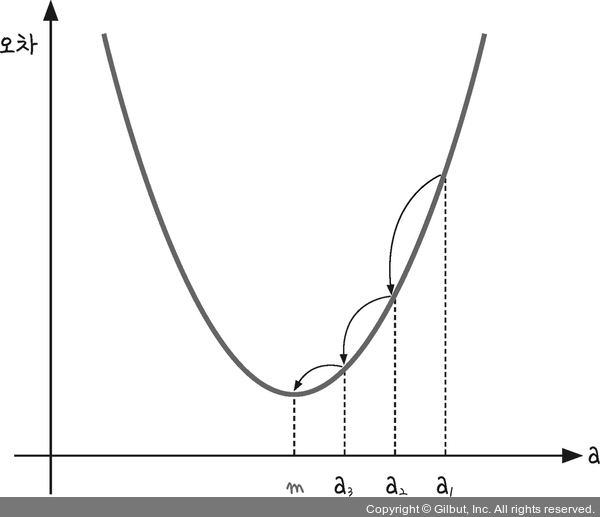
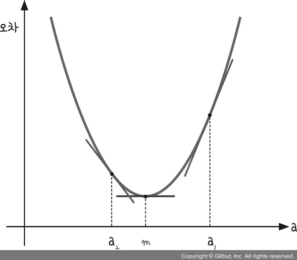
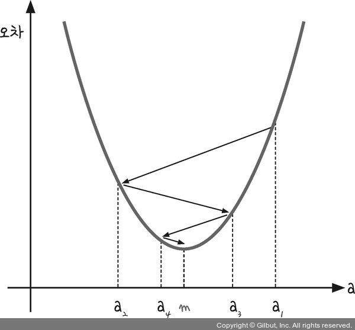
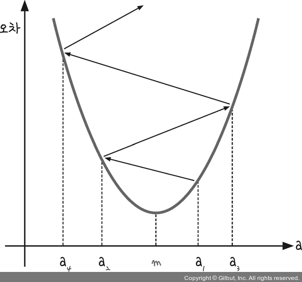
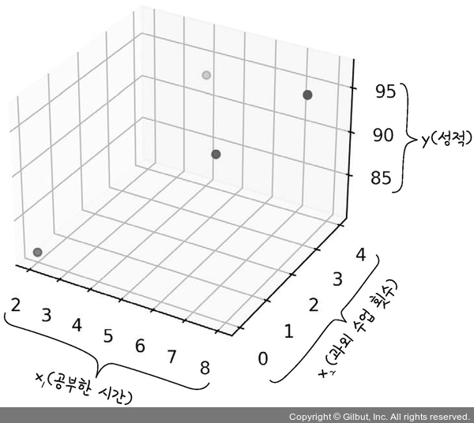
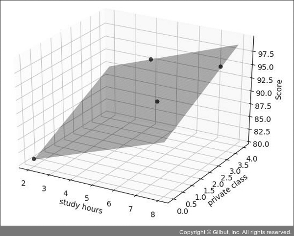
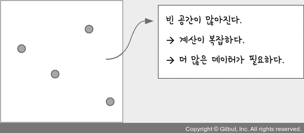
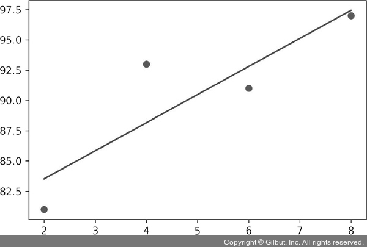

앞서 기울기 $a$를 너무 크게 잡으면 오차가 커지고, 기울기를 너무 작게 잡아도 오차가 커지는 것을 확인했다.<br>
이때 기울기가 무한대로 커지거나 무한대로 작아지면 그래프는 $y$축과 나란한 직선이 된다. 그러면 오차도 함께 무한대로 커진다.<br>
이를 다시 표현하면 기울기 $a$와 오차 사이에는 아래의 그래프와 같은 **이차 함수의 관계**가 있다는 의미가 된다.<br>
<p align="center"></p>

이 그래프상에서 오차가 가장 작을 때는 그래프의 가장 아래쪽 볼록한 부분에 이르렀을 때(기울기 $a$가 $m$의 위치에 있을 때)이다.<br>
임의의 기울기를 집어넣어 평균 제곱 오차를 구해 보았다. 그때의 기울기를 $a_1$이라고 한다면, 기울기를 적절히 바꾸어 $a_2$, $a_3$으로 이동시키다 결국 $m$에 이르게 하면 최적의 기울기를 찾게 된다.<br>
이 작업을 위해 $a_1$ 값보다 $a_2$ 값이 $m$에 더 가깝고, $a_3$ 값이 $a_2$ 값보다 $m$에 더 가깝다는 것을 판단하게 하는 방법이 바로 미분 기울기를 이용하는 **경사 하강법(gradient decent)** 이다.<br>
<br>

### 1. 경사 하강법의 개요
미분은 한 점에서의 순간 기울기다.<br>
$y = x^2$ 그래프에서 $x$에 다음과 같이 $a_1$, $a_2$ 그리고 $m$을 대입해 그 자리에서 미분하면 다음과 같이 각 점에서의 순간 기울기가 그려진다.<br>
<p align="center"></p>

가장 작은 오차를 찾기 위해서 최솟값 $m$에서의 순간 기울기를 봐야 한다.<br>
그래프가 이차 함수 포물선이므로 꼭짓점의 기울기는 $x$축과 평행한 선이 된다. 즉, **기울기가 0이다.** <br>
따라서 '미분 값이 0인 지점'을 찾는 것이 됩니다. 다음은 과정을 정리한 것이다.

1. $a_1$에서 미분을 구한다.
2. 구한 기울기의 반대 방향(기울기가 +면 음의 방향, -면 양의 방향)으로 얼마간 이동시킨 $a_2$에서 미분을 구한다.
3. 앞에서 구한 미분 값이 0이 아니면 1과 2 과정을 반복한다.

위 과정을 통하면 다음과 같이 기울기가 0인 한 점(m)으로 수렴한다.<br>
<p align="center"></p>

경사 하강법은 이렇게 반복적으로 기울기 $a$를 변화시켜서 $m$ 값을 찾아내는 방법이다.<br>
여기서 **학습률(learning rate)** 이라는 개념을 알 수 있다.<br>
기울기의 부호를 바꾸어 이동시킬 때 적절한 거리를 찾지 못해 너무 멀리 이동시키면 $a$ 값이 한 점으로 모이지 않고 다음과 같이 위로 치솟아 버린다.<br>
<p align="center"></p>

따라서 어느 만큼 이동시킬지 신중히 결정해야 하는데, 이때 이동 거리를 정해 주는 것이 바로 학습률이다.<br>
딥러닝에서 학습률의 값을 적절히 바꾸면서 최적의 학습률을 찾는 것은 중요한 최적화 과정 중 하나다.<br>
> 즉 **경사 하강법**은 오차의 변화에 따라 **이차 함수 그래프**를 만들고 적절한 **학습률**을 설정해 **미분 값이 0인 지점**을 구하는 것이다.

$y$ 절편 $b$의 값도 이와 같은 성질을 가지고 있다. $b$ 값이 너무 크면 오차도 함께 커지고, 너무 작아도 오차가 커진다. 그래서 최적의 $b$ 값을 구할 때 역시 경사 하강법을 사용한다.<br>
<br>

### 2. 파이썬 코딩으로 확인하는 선형 회귀

아래는 평균 제곱 오차의 식이다.

$$\dfrac{1}{n} \sum {(y_i - \hat{y}_i)^2 }$$

여기서 $\hat{y}$ 는 $y=ax+b$ 식에 $x_i$를 집어넣었을 때의 값이므로 $y_i=ax_i + b$를 대입하면 다음과 같다.

$$\dfrac{1}{n} \sum {(y_i - (ax_i + b))^2 }$$

식 전체를 미분하는 것이 아니라 필요한 값을 중심으로 미분(편미분)해야 하기 때문에 $a$와 $b$로 각각 편미분하면 다음과 같다.

$$a \text{로 편미분한 결과} = \dfrac{2}{n} \sum_{-x_i (y_i - (ax_i + b))}$$

$$b \text{로 편미분한 결과} = \dfrac{2}{n} \sum_{- (y_i - (ax_i + b))}$$

이를 파이썬 코드로 바꾸면 다음과 같다.
```python
y_pred = a * x + b            # 예측 값을 구하는 식입니다.
error = y - y_pred            # 실제 값과 비교한 오차를 error로 놓습니다.

a_diff = (2/n) * sum(-x * (error))  # 오차 함수를 a로 편미분한 값입니다.
b_diff = (2/n) * sum(-(error))      # 오차 함수를 b로 편미분한 값입니다.
```
<br>

여기에 학습률을 곱해 $a$값과 $b$값을 업데이트한다.

```python
lr = 0.03               # 학습률을 정합니다.
a = a - lr * a_diff     # 학습률을 곱해 기존의 a 값을 업데이트합니다.
b = b - lr * b_diff     # 학습률을 곱해 기존의 b 값을 업데이트합니다.
```
<br>
(참고)<br>
학습률 0.03<br>
여러 학습률을 적용해 보며 최적의 결과를 만드는 학습률을 찾아낸 것이다.<br>
최적의 학습률은 데이터와 딥러닝 모델에 따라 다르므로 그때그때 찾아내야 한다.<br>
<br>
전체 코드는 아래와 같다.

```python
import numpy as np
import matplotlib.pyplot as plt

# 공부 시간 X와 성 y의 넘파이 배열을 만듭니다.
x = np.array([2, 4, 6, 8])
y = np.array([81, 93, 91, 97])

# 데이터의 분포를 그래프로 나타냅니다.
plt.scatter(x, y)
plt.show()

# 기울기 a의 값과 절편 b의 값을 초기화합니다.
a = 0
b = 0

# 학습률을 정합니다.
lr = 0.03

# 몇 번 반복될지 설정합니다.
epochs = 2001 

# x 값이 총 몇 개인지 셉니다.
n = len(x)

# 경사 하강법을 시작합니다.
for i in range(epochs):      # 에포크 수만큼 반복합니다.
    y_pred = a * x + b       # 예측 값을 구하는 식입니다.
    error = y - y_pred       # 실제 값과 비교한 오차를 error로 놓습니다.

    a_diff = (2/n) * sum(-x * (error))   # 오차 함수를 a로 편미분한 값입니다.
    b_diff = (2/n) * sum(-(error))       # 오차 함수를 b로 편미분한 값입니다.

    a = a - lr * a_diff   # 학습률을 곱해 기존의 a 값을 업데이트합니다.
    b = b - lr * b_diff   # 학습률을 곱해 기존의 b 값을 업데이트합니다.

    if i $ 100 == 0:      # 100번 반복될 때마다 현재의 a 값, b 값을 출력합니다.
        print("epoch=$.f, 기울기=$.04f, 절편=$.04f" $ (i, a, b))
        
# 앞서 구한 최종 a 값을 기울기, b 값을 y 절편에 대입해 그래프를 그립니다.
y_pred = a * x + b      

# 그래프를 출력합니다.
plt.scatter(x, y)
plt.plot(x, y_pred,'r')
plt.show()
```

```
# 실행 결과
epoch=0, 기울기=27.8400, 절편=5.4300
epoch=100, 기울기=7.0739, 절편=50.5117
epoch=200, 기울기=4.0960, 절편=68.2822
... (중략) ...
epoch=1900, 기울기=2.3000, 절편=79.0000
epoch=2000, 기울기=2.3000, 절편=79.0000
```
<p align="center"></p>

(참고)<br>
에포크(epoch)는 입력 값에 대해 몇 번이나 반복해서 실험했는지 나타낸다.<br>
설정한 실험을 반복하고 100번마다 결과를 내놓는다.<br>
<br>
이렇게 최소 제곱법을 쓰지 않고 평균 제곱 오차와 경사 하강법을 이용해 원하는 값을 구할 수 있었다.<br>
이와 똑같은 방식을 $x$가 여러 개인 다중 선형 회귀에서도 사용한다.<br>
<br>

### 3. 다중 선형 회귀의 개요

앞서 학생들이 공부한 시간에 따른 예측 직선을 그리고자 기울기 $a$와 $y$ 절편 $b$를 구했다. 그런데 예측 직선을 이용해도 실제 성적 사이에는 약간의 오차가 있었다. 이러한 차이가 생기는 이유는 공부한 시간 외에 다른 요소가 성적에 영향을 끼쳤기 때문이다.<br>
더 정확한 예측을 하려면 추가 정보를 입력해야 하며, 정보를 추가해 새로운 예측 값을 구하려면 변수 개수를 늘려 **다중 선형 회귀**를 만들어 주어야 한다.<br>
<br>
예를 들어 일주일 동안 받는 과외 수업 횟수를 조사해서 다음과 같은 표가 작성됐다고 하자.

|공부한 시간 $(x_1)$|2|4|6|8|
|---|---|---|---|---|
|과외 수업 횟수 $(x_2)$|0|4|2|3|
|성적 $(y)$|81|93|91|97|

그럼 독립 변수가 두 개($x_1$과 $x_2$) 생기게 된다. 이를 사용해 종속 변수 $y$를 만들 경우 기울기를 두 개 구해야 하므로 다음과 같은 식이 나온다.

$$ y = a_1x_1 + a_2x_2 + b $$

<br>

### 4. 파이썬 코딩으로 확인하는 다중 선형 회귀

데이터의 분포를 그래프로 표현하면 다음과 같다.
```python
fig = plt.figure()
ax = fig.add_subplot(111, projection='3d')
ax.scatter3D(x1, x2, y);
plt.show()
```
<p align="center"></p>

(참고)<br>
앞서 선형 회귀는 선을 긋는 작업이라고 했다. 그러면 다중 선형 회귀는 어떨까?<br>
최적의 결과를 찾은 후 이를 그래프로 표현하면 다음과 같이 평면으로 표시된다.<br>
<p align="center"></p>

직선상에서 예측하던 것이 평면으로 범위가 넓어지므로 계산이 복잡해지고 더 많은 데이터를 필요로 하게 된다.<br>
단순 선형 회귀<br>
<p align="center"></p>

다중 선형 회귀
<p align="center"></p>
<br>

전체 코드는 다음과 같다.
```python
import numpy as np
import matplotlib.pyplot as plt

# 공부 시간 x1과 과외 시간 x2, 성적 y의 넘파이 배열을 만듭니다.
x1 = np.array([2, 4, 6, 8])
x2 = np.array([0, 4, 2, 3])
y = np.array([81, 93, 91, 97])

# 데이터의 분포를 그래프로 나타냅니다.
fig = plt.figure()
ax = fig.add_subplot(111, projection='3d')
ax.scatter3D(x1, x2, y);
plt.show()

# 기울기 a의 값과 절편 b의 값을 초기화합니다.
a1 = 0
a2 = 0
b = 0

# 학습률을 정합니다.
lr = 0.01 

# 몇 번 반복될지 설정합니다.
epochs = 2001 

# x 값이 총 몇 개인지 셉니다. x1과 x2의 수가 같으므로 x1만 세겠습니다.
n = len(x1)

# 경사 하강법을 시작합니다.
for i in range(epochs):             # 에포크 수만큼 반복합니다.
    
    y_pred = a1 * x1 + a2 * x2 + b  # 예측 값을 구하는 식을 세웁니다.
    error = y - y_pred              # 실제 값과 비교한 오차를 error로 놓습니다.
    
    a1_diff = (2/n) * sum(-x1 * (error))  # 오차 함수를 a1로 편미분한 값입니다.
    a2_diff = (2/n) * sum(-x2 * (error))  # 오차 함수를 a2로 편미분한 값입니다.
    b_diff = (2/n) * sum(-(error))        # 오차 함수를 b로 편미분한 값입니다.
    
    a1 = a1 - lr * a1_diff      # 학습률을 곱해 기존의 a1 값을 업데이트합니다.
    a2 = a2 - lr * a2_diff      # 학습률을 곱해 기존의 a2 값을 업데이트합니다.
    b = b - lr * b_diff         # 학습률을 곱해 기존의 b 값을 업데이트합니다.
    
    if i $ 100 == 0:   # 100번 반복될 때마다 현재의 a1, a2, b의 값을 출력합니다.
        print("epoch=$.f, 기울기1=$.04f, 기울기2=$.04f, 절편=$.04f" $ (i, a1, a2, b))
```

```python
# 실제 점수와 예측된 점수를 출력합니다.
print("실제 점수: ", y)
print("예측 점수: ", y_pred)
```

```
# 실행 결과
... (전략) ...
epoch=1700, 기울기1=1.5496, 기울기2=2.3028, 절편=77.5168
epoch=1800, 기울기1=1.5361, 기울기2=2.2982, 절편=77.6095
epoch=1900, 기울기1=1.5263, 기울기2=2.2948, 절편=77.6769
epoch=2000, 기울기1=1.5191, 기울기2=2.2923, 절편=77.7260
실제 점수: [81 93 91 97]
예측 점수: <[80.76387645 92.97153922 91.42520875 96.7558749]
```

2,000번 반복했을 때 최적의 기울기 $a_1$과 $a_2$ 및 절편을 찾아가며 실제 점수에 가까운 예측 값을 만들어 내고 있음을 알 수 있다.<br>
<br>

### 5. 텐서플로에서 실행하는 선형 회귀, 다중 선형 회귀 모델

선형 회귀는 현상을 분석하는 방법의 하나이다. 머신 러닝은 이러한 분석 방법을 이용해 예측 모델을 만드는 것이다. 따라서 두 분야에서 사용하는 용어가 약간 다르다.<br>
예를 들어 함수 $y = ax + b$는 공부한 시간과 성적의 관계를 유추하기 위해 필요했던 식이었다.<br>
이렇게 문제를 해결하기 위해 가정하는 식을 머신 러닝에서는 **가설 함수(hypothesis)** 라고 하며 $H(x)$라고 표기한다.<br>
또 기울기 $a$는 변수 $x$에 어느 정도의 가중치를 곱하는지 결정하므로, **가중치(weight)** 라고 하며, $w$로 표시한다.<br>
절편 $b$는 데이터의 특성에 따라 따로 부여되는 값이므로 **편향(bias)** 이라고 하며, $b$로 표시한다.<br>
따라서 우리가 앞서 배운 $y = ax + b$는 머신 러닝에서 다음과 같이 표기된다.

$$ y = ax + b ➡︎ H(x) = wx + b $$

또한, 평균 제곱 오차처럼 실제 값과 예측 값 사이의 오차에 대한 식을 **손실 함수(loss function)** 라고 한다.<br>
최적의 기울기와 절편을 찾기 위해 사용한 경사 하강법을 딥러닝에서는 **옵티마이저(optimizer)** 라고 한다. 경사 하강법은 딥러닝에서 사용하는 여러 옵티마이저 중 하나이다.<br>

```python
model.add(Dense(1, input_dim=1, activation='linear')) ----- ➊
model.compile(optimizer='sgd', loss='mse') -----  ➋
model.fit(x, y, epochs=2000) ----- ➌
```
➊ 가설 함수는 $H(x) = wx + b$ 이다. 이때 출력되는 값(=성적)이 하나씩이므로 Dense() 함수의 첫 번째 인자에 1이라고 설정한다.<br>
입력될 변수(=학습 시간)도 하나뿐이므로 input_dim 역시 1이라고 설정한다.<br>
입력된 값을 다음 층으로 넘길 때 각 값을 어떻게 처리할지를 결정하는 함수를 **활성화 함수**라고 한다.<br>
activation은 활성화 함수를 정하는 옵션이다. 여기에서는 선형 회귀를 다루고 있으므로 'linear'라고 설정한다.<br>
딥러닝 목적에 따라 다른 활성화 함수를 넣을 수 있는데, 예를 들어 시그모이드 함수가 필요하다면 ‘sigmoid’라고 넣어 주면 된다.<br>
➋ 앞서 배운 경사 하강법을 실행하려면 옵티마이저에 sgd라고 설정한다. 손실 함수는 평균 제곱 오차를 사용할 것이므로 mse라고 설정한다.<br>
➌ 끝으로 앞서 따로 적어 주었던 epochs 숫자를 model.fit() 함수에 적는다.<br>
<br>
학습 시간(x)이 입력되었을 때의 예측 점수는 model.predict(x)로 알 수 있다. 예측 점수로 그래프를 그려 보면 다음과 같다.
```python
plt.scatter(x, y)
plt.plot(x, model.predict(x), 'r')    # 예측 결과를 그래프로 나타냅니다.
plt.show()
```
<br>

전체 코드는 다음과 같다.
```python
import numpy as np
import matplotlib.pyplot as plt

# 텐서플로의 케라스 API에서 필요한 함수들을 불러옵니다.
from tensorflow.keras.models import Sequential
from tensorflow.keras.layers import Dense

x = np.array([2, 4, 6, 8])
y = np.array([81, 93, 91, 97])

model = Sequential()

# 출력 값, 입력 변수, 분석 방법에 맞게끔 모델을 설정합니다.
model.add(Dense(1, input_dim=1, activation='linear'))

# 오차 수정을 위해 경사 하강법(sgd)을, 오차의 정도를 판단하기 위해
# 평균 제곱 오차(mse)를 사용합니다.
model.compile(optimizer='sgd', loss='mse')

# 오차를 최소화하는 과정을 2000번 반복합니다.
model.fit(x, y, epochs=2000)

plt.scatter(x, y)
plt.plot(x, model.predict(x), 'r')    # 예측 결과를 그래프로 나타냅니다.
plt.show()

# 임의의 시간을 집어넣어 점수를 예측하는 모델을 테스트해 보겠습니다.
hour = 7
prediction = model.predict([hour])
print("$.f시간을 공부할 경우의 예상 점수는 $.02f점입니다." $ (hour, prediction))
```
```
# 실행결과
Epoch 1/2000
1/1 [==============================] - 1s 114ms/step - loss: 9241.3984
... (중략) ...
Epoch 2000/2000
1/1 [==============================] - 0s 2ms/step - loss: 8.3022

[그래프]

7시간을 공부할 경우의 예상 점수는 95.12점입니다.
```
<p align="center"></p>
<br>
앞서 구한 선형 회귀 결과와 같은 그래프를 구했다. 그리고 임의의 시간을 넣었을 때 예상되는 점수를 보여 준다.<br>
다중 선형 회귀 역시 텐서플로를 이용해서 실행해 보자. 입력해야 하는 변수가 한 개에서 두 개로 늘었으므로 input_dim 부분을 2로 변경해준다.

```python
model.add(Dense(1, input_dim=2, activation='linear'))
```

그리고 변수가 두 개이므로, 모델의 테스트를 위해서도 변수를 두 개 입력해야 한다.<br>
임의의 학습 시간과 과외 시간을 입력했을 때의 점수는 다음과 같이 설정해서 구한다.

```python
hour = 7
private_class = 4
prediction = model.predict([[hour, private_class]])

print("$.f시간을 공부하고 $.f시간의 과외를 받을 경우, 예상 점수는 $.02f점입니다." $ (hour, private_class, prediction))
```

모든 코드를 정리하면 다음과 같다.

```python
import numpy as np
import matplotlib.pyplot as plt

# 텐서플로의 케라스 API에서 필요한 함수들을 불러옵니다.
from tensorflow.keras.models import Sequential
from tensorflow.keras.layers import Dense

x = np.array([[2, 0], [4, 4], [6, 2], [8, 3]])
y = np.array([81, 93, 91, 97])

model = Sequential()

# 입력 변수가 두 개(학습 시간, 과외 시간)이므로 input_dim에 2를 입력합니다.
model.add(Dense(1, input_dim=2, activation='linear'))
model.compile(optimizer='sgd', loss='mse')

model.fit(x, y, epochs=2000)

# 임의의 학습 시간과 과외 시간을 집어넣어 점수를 예측하는 모델을 테스트해 보겠습니다.
hour = 7
private_class = 4
prediction = model.predict([[hour, private_class]])

print("$.f시간을 공부하고 $.f시간의 과외를 받을 경우, 예상 점수는 $.02f점입니다." $ (hour, private_class, prediction))
```
```
# 실행 결과
Epoch 1/2000
1/1 [==============================] - 0s 119ms/step - loss: 8184.9204
... (중략) ...
Epoch 2000/2000
1/1 [==============================] - 0s 2ms/step - loss: 0.0743

7시간을 공부하고 4시간의 과외를 받을 경우, 예상 점수는 97.53점입니다.
```